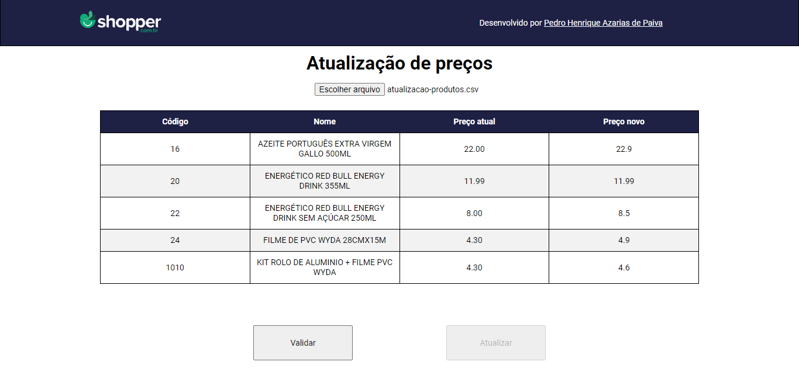

# Desafio Shopper

## Orientações de Instalação

Siga estas instruções para instalar e executar o projeto em sua máquina local:

1. Clone o repositório Git em sua máquina local.
2. Abra o terminal em seu VSCode.
3. Acesse primeiro a pasta backend, utilizando o comando `cd ./backend-shopper/`.
4. No terminal, digite `npm install`.
5. Após a instalação das dependências, digite `npm start`. O servidor será iniciado na porta localhost:3000.
6. Abra um novo terminal em seu VSCode, mantendo o primeiro terminal aberto (que está executando o servidor do projeto).
7. No novo terminal, navegue até a pasta frontend utilizando o comando `cd ./frontend-shopper/`.
8. Digite `npm install` para instalar as dependências novamente.
9. Digite `npm start`. O servidor informará que já existe algo rodando na porta :3000 e perguntará se você deseja utilizar outra porta; pressione 'y'.
10. O projeto começará a rodar.

### Importante

1. É fundamental iniciar primeiro o servidor backend e, em seguida, o servidor frontend.
2. O sistema é capaz de ler arquivos no formato CSV, cuja estrutura deve conter apenas 'product_code,new_price' no cabeçalho, com os valores logo abaixo, separados apenas por vírgulas.
3. Em caso de números decimais, eles devem estar formatados com '.' em vez de ','; por exemplo:
product_code,new_price
18,12.90
4. O sistema só aceita valores de 'product_code' que foram estabelecidos no banco de dados deste desafio.

## Funcionalidades

O sistema é capaz de:

1. Ler arquivos de atualização de preço em formato CSV.
2. Verificar se as informações do arquivo estão no formato correto.
3. Buscar informações dos produtos no banco de dados de acordo com o 'product_code' no arquivo CSV.
4. Preencher a tabela central com as informações encontradas no arquivo, contendo Código, Nome, Preço atual e Preço novo.
5. Lidar com o clique do botão "Validar", que verifica se a tabela foi preenchida corretamente e se nenhuma regra de negócio foi quebrada, como por exemplo:
- Não permitir alterações de preço acima de 10% do valor do produto.
- Não permitir que o preço novo seja inferior ao preço de custo.
6. O botão "Atualizar" só é habilitado após a validação bem-sucedida.
7. Ao clicar no botão "Atualizar", os preços dos produtos são atualizados diretamente no banco de dados.
8. Se um produto fizer parte de um grupo de produtos, o preço do grupo é atualizado proporcionalmente.

## 🤝 Responsável pelo projeto

<table>
  <tr>
    <td align="center">
      <a href="#">
       
        
          <b> Pedro Henrique</b>
        
      </a>
    </td>
  </tr>
</table>